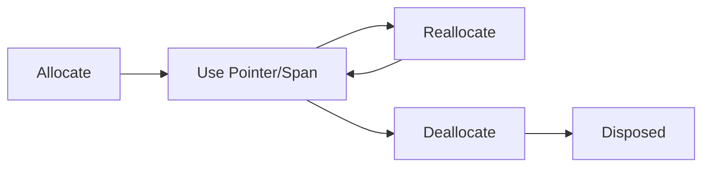

# NatLib — idk what exactly it is for C#

That is a benchmark test for struct operations. Only for Unit2 and composers of Unit2. Why I placed it here? 'Cos I want to see on what i wasted all day! Oh, you just need to look on `Mean` column and divide it on 1.000.000+- to get time for one operation.
| Method                      | Mean       | Error   | StdDev  | Allocated |
|---------------------------- |-----------:|--------:|--------:|----------:|
| Unit2_ReadProperty          |   216.4 us | 0.11 us | 0.10 us |         - |
| Unit2_WriteProperty         |   216.5 us | 0.14 us | 0.12 us |         - |
| ComposedUnit2_ReadProperty  |   216.5 us | 0.18 us | 0.15 us |         - |
| ComposedUnit2_WriteProperty |   216.4 us | 0.14 us | 0.12 us |         - |
| Unit2_Create                | 1,297.9 us | 0.41 us | 0.38 us |         - |
| Composed_Create             | 1,297.6 us | 0.25 us | 0.23 us |         - |
| Unit2ToComposed             | 1,081.6 us | 0.39 us | 0.36 us |         - |
| ComposedToUnit2             | 1,081.3 us | 0.37 us | 0.33 us |         - |
| Unit2_ObjectArithmetic      | 1,082.1 us | 1.57 us | 1.31 us |         - |
| Composed_ObjectArithmetic   | 1,083.5 us | 2.63 us | 2.33 us |         - |
| Unit2_TArithmetic           | 1,297.5 us | 0.43 us | 0.36 us |         - |
| Composed_TArithmetic        | 1,297.5 us | 0.21 us | 0.18 us |         - |
| Unit2_IEquatable            |   541.3 us | 0.55 us | 0.46 us |         - |
| Composed_IEquatable         |   541.1 us | 0.27 us | 0.24 us |         - |
| Unit2_Equals                |   655.6 us | 4.83 us | 4.52 us |         - |
| Composed_Equals             |   650.5 us | 1.26 us | 1.12 us |         - |
| Unit2_Existing              | 2,591.6 us | 0.45 us | 0.42 us |         - |
| Composed_Existing           | 2,592.1 us | 0.61 us | 0.51 us |         - |


A **high-performance, unmanaged array** implementation for C# that allows direct control over memory allocation, reallocation, and deallocation using `NativeMemory`.  
Designed for systems programming, game engines, and any low-level environment where performance and control matter more than safety.

---

## Features

- **Manual memory management** — full control over allocation and freeing  
-  **True unmanaged array** — stored outside the CLR heap  
-  **Maximum performance** — no GC overhead, ideal for tight loops  
-  **Optional initialization** — choose whether to run constructors for your structs  
-  **Safe API boundaries** — explicit `Allocate()`, `Reallocate()`, and `Deallocate()` calls  
-  **Span view support** — lightweight view with pointer access

---

## Concept

Unlike regular C# arrays, `NatArrays` does **not** live on the managed heap.  
You control exactly when and how memory is allocated and released — similar to `malloc`, `realloc`, and `free` in C/C++.

> This makes it perfect for performance-critical code, native interop, graphics, ECS systems, or custom memory pools.

---

## Initialization Control

You decide whether constructors for your structs are called.

```csharp
// Allocates memory only (uninitialized)
array.Allocate(256);

// Allocates memory and calls 'new T()' for each element
array.AllocateDefault(256);
```

You can also reallocate an existing array while preserving old values:

```csharp
array.Reallocate(512);         // Resizes raw memory
array.ReallocateDefault(512);  // Resizes and calls constructors for new slots
```

---

## Safety Notes

- These arrays are unsafe — you are responsible for correct usage.
- Never use spans or pointers after a Reallocate() or Deallocate() call.
- **Always call Dispose()** or use a using block to avoid memory leaks.

---

## Requirements

- **.NET 8.0** or newer (currently built for .NET 9)
- unsafe context enabled in your project

**How to?**
```xml
<PropertyGroup>
  <AllowUnsafeBlocks>true</AllowUnsafeBlocks>
</PropertyGroup>
```
(when you look for such lowlevel lib, you probably know already how to enable unsafe context in project. Ask LLM if not)) )

---

## Graph
Here is a simple graph that shows how it all works.

(idk how that might help, but i'll just leave it here, it looks cool)



---

## License

```
MIT License with Attribution Requirement

Copyright (c) 2025 starplaysyt
https://github.com/starplaysyt/NatArrays

Permission is hereby granted, free of charge, to any person obtaining a copy
of this software and associated documentation files (the “Software”), to deal
in the Software without restriction, including without limitation the rights
to use, copy, modify, merge, publish, distribute, sublicense, and/or sell
copies of the Software, subject to the following conditions:

1. Attribution is required.
   Any redistributions of this software, in source or binary forms, must
   include a prominent attribution to the original author and repository URL
   (for example, in documentation, “About” dialogs, or credits).

2. The above copyright notice and this permission notice shall be included in
   all copies or substantial portions of the Software.

THE SOFTWARE IS PROVIDED “AS IS”, WITHOUT WARRANTY OF ANY KIND, EXPRESS OR
IMPLIED, INCLUDING BUT NOT LIMITED TO THE WARRANTIES OF MERCHANTABILITY,
FITNESS FOR A PARTICULAR PURPOSE AND NONINFRINGEMENT. IN NO EVENT SHALL THE
AUTHORS OR COPYRIGHT HOLDERS BE LIABLE FOR ANY CLAIM, DAMAGES OR OTHER
LIABILITY, WHETHER IN AN ACTION OF CONTRACT, TORT OR OTHERWISE, ARISING FROM,
OUT OF OR IN CONNECTION WITH THE SOFTWARE OR THE USE OR OTHER DEALINGS IN
THE SOFTWARE.
```
