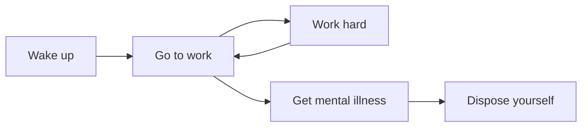

# NatLib


## About

**NatLib** is a general-purpose library that complements the functionality of the C# BCL by improving the semantics
and mechanics of interaction with the programming language as a whole. Here, I bring together everything that can be
unified for my projects, including the implementation of basic functions, structures, and even entire architectural
patterns. Overall, it contains a set of relatively simple implementations to achieve clear goals (my goals)
in my projects.

---

## What's inside

- **NatLib.Arrays** - implementation of arrays in unmanaged heap, can serve different purposes, developed for using in
  everything connected to rendering graphics.
- **NatLib.Benchmarks** - not a module, a playground for performance testings for me.
- **NatLib.Core** - general part of the library. Contains unified structures, reflection helpers, utility classes what
  extends functionality of BCL, or provide direct control for some operations.
- **NatLib.DataManagement** - currently empty due to my laziness, unwillingness to deal with ancient shitlegasy and
  my own shitcode. There should have been that picture of a man with a plumbing hose unloading shit from a Docker container
  with the caption "Vibecoded", maybe I'll put it here, I don't know
- **NatLib.Debug** - not a module, like the name saying - it's executable for debug. Why is it here? Because sometimes
  I need to have the same Program.cs file on laptop and computer, to sync my work, you know?
- **NatLib.ECS** - currently empty, but the code is completed, now I want to extend it in some ways, so it will be here
  pretty soon.
- **NatLib.Logging** - provides simple logging operations, somewhere where I don't want to use popular libraries.
- **NatLib.Reactive** - my try to implement binding context based on INotifyPropertyChanged and ref-based algorythm.
  Currently not released.
- **NatLib.Server** - there should be basic implementations of services for ASP.NET, and i also have them, but they are
  not ready for release, and I wanna deal with other stuff right now.
- **NatLib.Tests** - not a module, just a testing playground with xUnit.
- **NatLib.UniConsole** - contains completed and extendable console-style conversation system and provides ways of
  "rendering" something in console(like lines, message-boxed, and other unicode-art stuff)

---

## That plumber picture i thought i lost

Caption on the picture - "Vibecoded".


Why is it here? I don't know. I hope this photo at least makes you laugh, in our world full of hopelessness, sodomy, violence, cringe, and idiocy. And yes, I'm still talking about programming, and I personally consider Rust's OOP to be a form of violence.

---

## Safety Notes

**IF YOU EVER** thought about **using this** somewhere likely **named as "Release" or "Production"** - **STAY AWAY!** Seriously, you can find libraries lot better than this(but not with unmanaged arrays separately, btw..). USE ON YOUR OWN RISK, every day i find exceptions here, and sometimes i have an urge to implement kind of new architectural pattern out there, so even I sometimes have compatibility problems. And that's why it will never be on NuGet - I don't want people to struggle.

---

## Requirements

- **.NET 10**
- a stable nervous system
- a set of high alcohol drinks, personally I can recommend absinthe, cognac, russian vodka, or pure medical alcohol (the kind you use to clean keyboards or wipe blood off the carpet after deadly duels with Python or Javascript developers)

---

## Graph

Here is a simple graph that shows how it all works.


```mermaid
graph LR;
  A[Wake up] --> B[Go to work]
  B --> C[Work hard]
  B --> D[Get mental illness]
  C --> B
  D --> X[Dispose yourself]
```
---

## License

Remember what I told about using this in production? Read it again. If you still want to - read that text below. Maybe it'll change your mind.

```
MIT License with Attribution Requirement

Copyright (c) 2025 starplaysyt
https://github.com/starplaysyt/NatArrays

Permission is hereby granted, free of charge, to any person obtaining a copy
of this software and associated documentation files (the “Software”), to deal
in the Software without restriction, including without limitation the rights
to use, copy, modify, merge, publish, distribute, sublicense, and/or sell
copies of the Software, subject to the following conditions:

1. Attribution is required.
   Any redistributions of this software, in source or binary forms, must
   include a prominent attribution to the original author and repository URL
   (for example, in documentation, “About” dialogs, or credits).

2. The above copyright notice and this permission notice shall be included in
   all copies or substantial portions of the Software.

THE SOFTWARE IS PROVIDED “AS IS”, WITHOUT WARRANTY OF ANY KIND, EXPRESS OR
IMPLIED, INCLUDING BUT NOT LIMITED TO THE WARRANTIES OF MERCHANTABILITY,
FITNESS FOR A PARTICULAR PURPOSE AND NONINFRINGEMENT. IN NO EVENT SHALL THE
AUTHORS OR COPYRIGHT HOLDERS BE LIABLE FOR ANY CLAIM, DAMAGES OR OTHER
LIABILITY, WHETHER IN AN ACTION OF CONTRACT, TORT OR OTHERWISE, ARISING FROM,
OUT OF OR IN CONNECTION WITH THE SOFTWARE OR THE USE OR OTHER DEALINGS IN
THE SOFTWARE.
```
